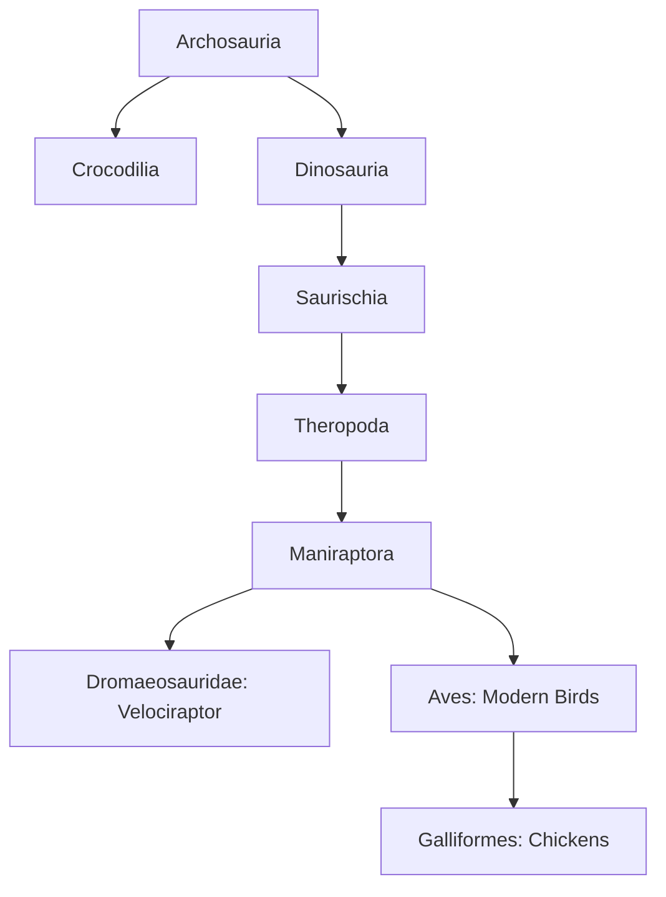

## Chapter 1: Laying the Foundations – Evolutionary Biology and Phylogenetic Basics

Prior to altering even a solitary nucleotide, one must internalize the evolutionary lineage to ensure that reversal initiatives are phylogenetically astute and biologically coherent. This chapter furnishes an exhaustive foundational overview of the dinosaur-to-bird continuum, equipping practitioners with the requisite knowledge to target appropriate genetic loci and anticipate developmental trajectories.

### 1.1: Phylogenetic Mapping – Tracing the Lineage from Theropods to Galliformes

Velociraptors are classified within the Dromaeosauridae subfamily of the Maniraptora clade, a subgroup of coelurosaurian theropod dinosaurs that shares a particularly intimate evolutionary affinity with the avian lineage (Aves). Fossil records, exemplified by the renowned "Fighting Dinosaurs" specimen—a velociraptor preserved in mortal combat with a Protoceratops—depict an organism approximately 2 meters in length and weighing 15-20 kilograms, adorned with quill knobs on its skeletal elements indicative of pennaceous feathers employed for insulation, display, or possibly aerodynamic assistance. Chickens, though diminutive at 2-4 kilograms in adulthood, preserve vestigial manifestations of these attributes: their pedal morphology mirrors velociraptor claws with three anterior toes and a vestigial hallux (dewclaw), while ontogenetic stages in embryonic development transiently exhibit caudal appendages and odontogenic tissues that are subsequently resorbed through programmed apoptosis.

For visual perspicuity, consider the following cladogram, which delineates the hierarchical relationships:

This phylogenetic diagram underscores synapomorphies (shared derived characteristics) such as pneumatized skeletal elements for enhanced mobility, a furcula for stabilizing the shoulder girdle during locomotion or incipient flight, and an S-curved cervical vertebral column for efficient head movement. Molecular corroboration arises from proteomic analyses: collagen sequences derived from chicken tissues exhibit striking homology to those isolated from Tyrannosaurus rex fossils, affirming a biochemical continuum across the theropod-bird transition.

### 1.2: Atavistic Traits – Unlocking Dormant Dino Genes in Chickens

Atavisms denote the re-expression of phylogenetically ancestral phenotypes, frequently elicited through mutational perturbations or targeted interventions. In avian models like the chicken, the *talpid2* genetic mutation precipitates the formation of archosaurian-grade dentition, manifesting as sharp, conical teeth akin to those in crocodilians—structures wholly absent in extant birds due to evolutionary adaptations for beak-based foraging. Analogously, pharmacological or genetic inhibition of fibroblast growth factor (FGF) signaling cascades impedes the resorption of the embryonic tail, resulting in hatchlings bearing 14-16 free caudal vertebrae rather than the fused pygostyle characteristic of modern avians, thereby approximating the prehensile tail of maniraptoran dinosaurs.

To systematize this, the following table enumerates prominent atavistic traits amenable to activation in chickens, with attendant mechanisms and empirical precedents:

| **Trait** | **Ancestral Form**                      | **Modern Suppression Mechanism**                      | **Activation Method**                          | **Real Experiment Example**                                                             |
| --------- | --------------------------------------- | ----------------------------------------------------- | ---------------------------------------------- | --------------------------------------------------------------------------------------- |
| Teeth     | Conical, multi-row replacement          | BMP4 overexpression suppressing odontogenesis         | *Talpid2* mutation or SHH pathway modulation   | Mutant chicks exhibiting alligator-like teeth (2006 developmental biology study)        |
| Tail      | Long, segmented with ossified vertebrae | Hox gene-mediated fusion into pygostyle               | FGF8 inhibition during embryogenesis           | Extended tails observed in modified embryos (Jack Horner's chickenosaurus initiative)   |
| Snout     | Elongated, dentigerous rostrum          | FGF/BMP signaling enforcing beak keratinization       | Molecular antagonism of beak-forming genes     | Dinosaur-like facial structures in chicken embryos (2015 Yale University research)      |
| Claws     | Hyperextensible sickle on digit II      | Keratin gene downregulation and bone remodeling       | HOXD cluster upregulation for digit elongation | Experimental fibula lengthening yielding proto-claws (ongoing theropod anatomy studies) |
| Feathers  | Filamentous proto-feathers              | Already extant but simplified; modifiable for display | Beta-keratin gene tweaks for pennaceous quills | Design informed by feathered dromaeosaurid fossils (e.g., Microraptor specimens)        |

These phenomena are governed by conserved developmental gene networks: the Hox gene clusters orchestrate axial and appendicular patterning, while the Sonic Hedgehog (SHH) signaling pathway delineates craniofacial and limb morphologies. In a practical scenario, initial screening of chicken embryos via high-throughput sequencing would uncover latent velociraptor-homologous alleles, with per-genome costs plummeting to approximately $100 in 2025 due to advancements in next-generation sequencing platforms.

### 1.3: Comparative Anatomy – Velociraptor vs. Chicken Dissections

A meticulous comparative anatomical analysis is indispensable for pinpointing modifiable structures. Velociraptors possessed an encephalic configuration suggestive of acute sensory acuity, featuring enlarged olfactory bulbs and a relatively capacious cerebellum for coordinated predation; chickens, with their comparatively diminutive encephalization quotient, can nonetheless be augmented through overexpression of brain-derived neurotrophic factor (BDNF) genes to foster neural proliferation and synaptic density. Pedal anatomy offers another parallel: the velociraptor's tarsometatarsus and phalanges facilitated a retractable second toe with a keratinous sickle claw for slashing prey, whereas the chicken's analogous structure is truncated but extensible via targeted elongation of the fibula and upregulation of collagen synthesis.

**Illustrative Subscenario**: Employ computed tomography (CT) scans of velociraptor holotypes from institutions like the American Museum of Natural History (AMNH), superimposed upon magnetic resonance imaging (MRI) datasets from chicken ontogeny, to delineate precise osteological targets for surgical or genetic intervention, thereby minimizing off-target developmental disruptions.

### 1.4: Genetic and Epigenetic Frameworks – The Molecular Toolbox

The chicken genome comprises roughly 20,000 protein-coding genes, with 60-70% exhibiting sequence homology to inferred theropod genomes based on comparative genomics. Epigenetic modifications, particularly cytosine methylation at CpG islands, enforce the transcriptional silencing of ancestral loci; demethylating agents such as 5-azacytidine or histone deacetylase (HDAC) inhibitors can reinstate expression by altering chromatin accessibility. For enhanced realism, consult recent advancements in Horner's research as of 2024-2025, which demonstrate tangible progress in reversing tail truncation, albeit with persistent challenges in decoupling the pygostyle fusion from associated urogenital functions.

Discourse within online communities, such as X (formerly Twitter), reveals a spectrum of sentiments: enthusiastic endorsements of the "chickenosaurus" as a de-extinction proxy coexist with skeptical critiques regarding ethical overreach and biological feasibility, with some envisioning chimeric outcomes akin to oviraptorid avians.

---

*This work by [@diagonalcounty](https://github.com/diagonalcounty) is licensed under [CC-BY-4.0](https://creativecommons.org/licenses/by/4.0/).*
